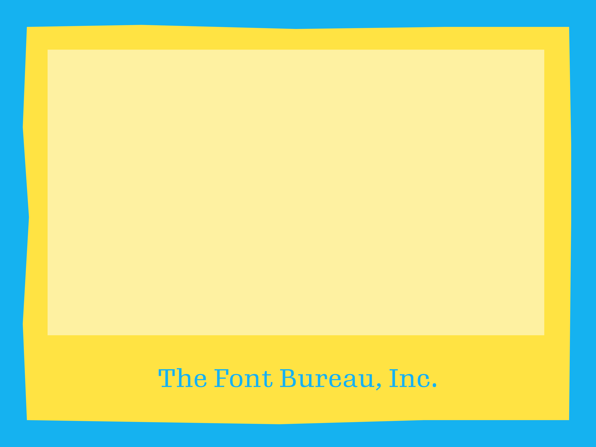
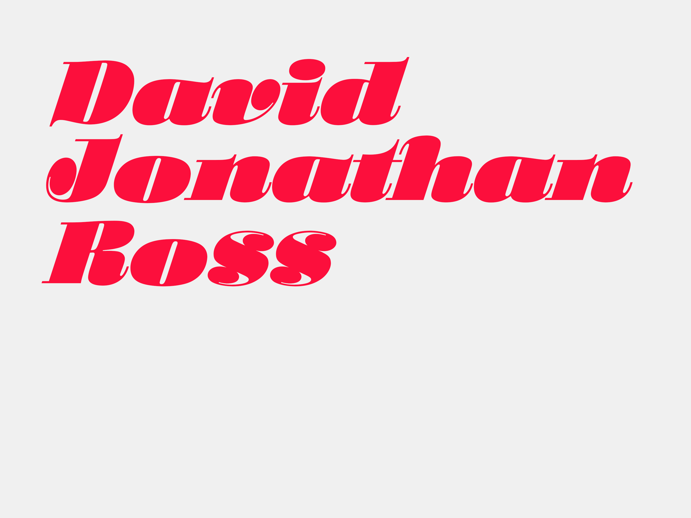
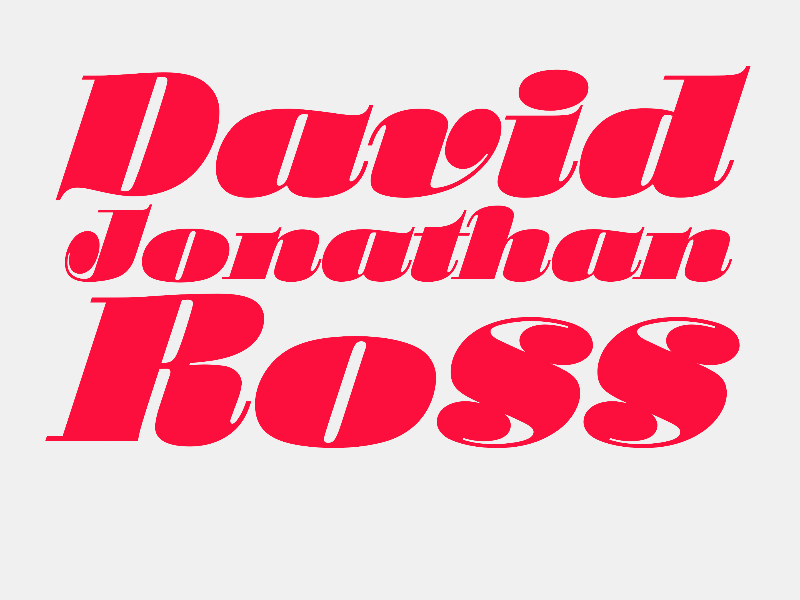
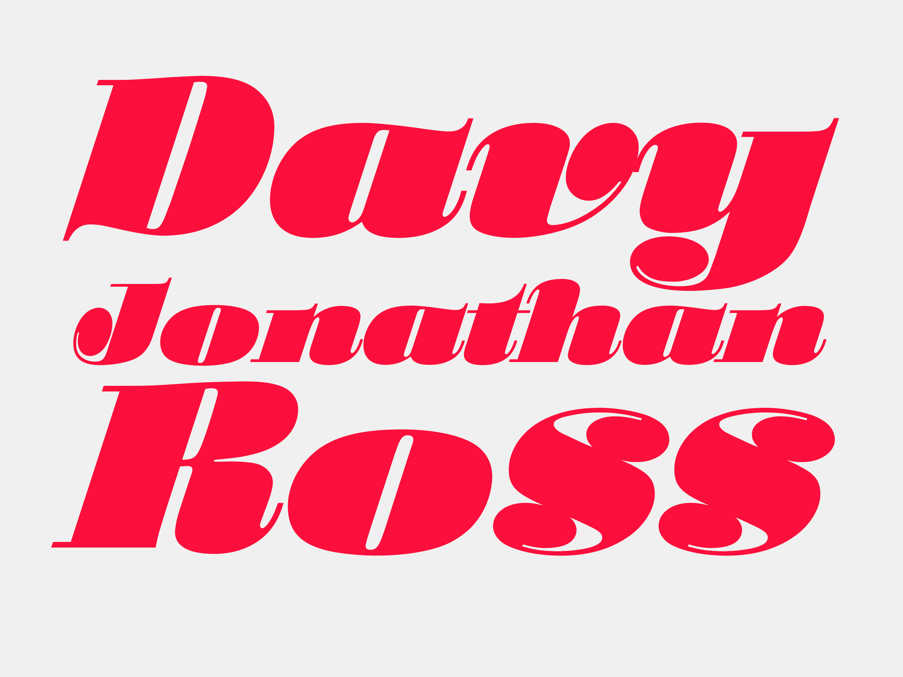
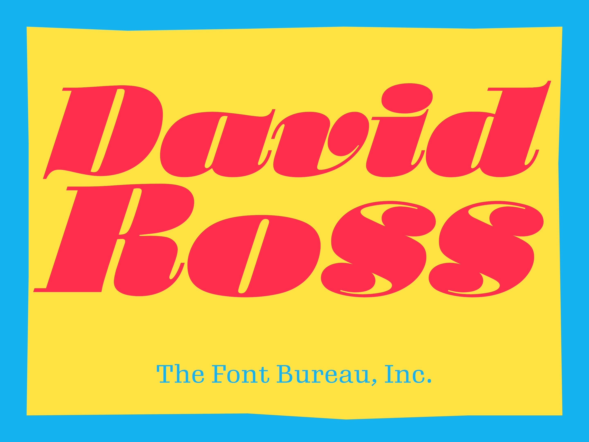
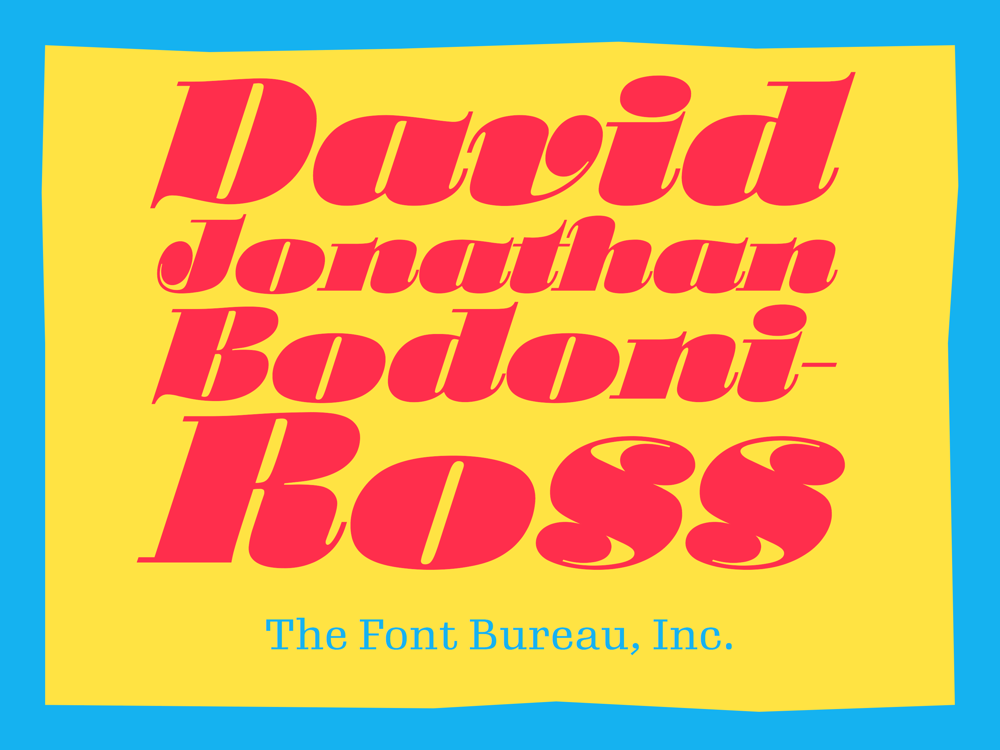
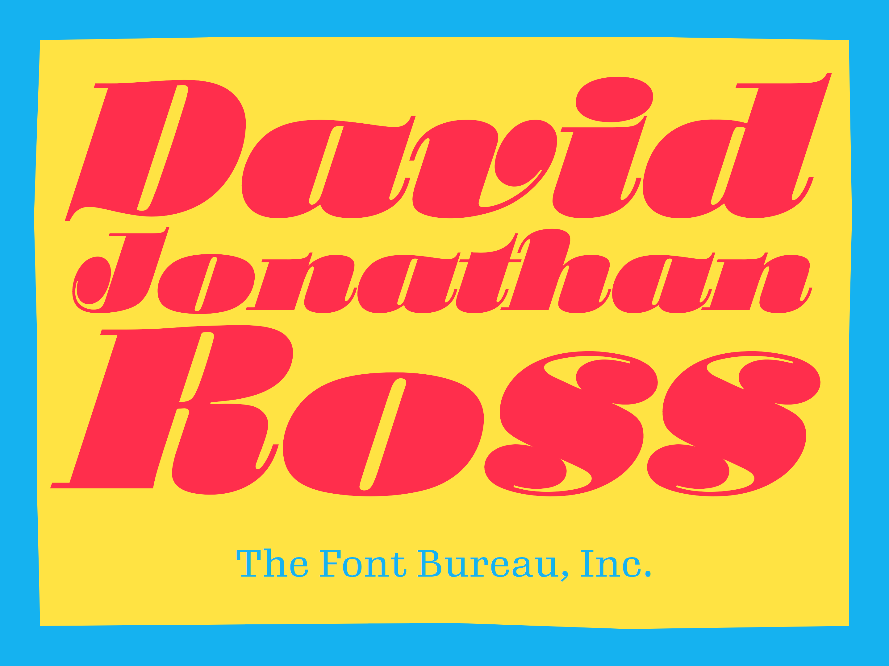
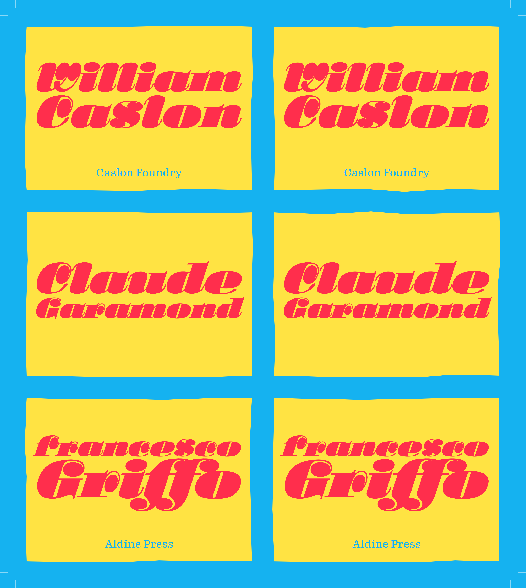

# BadgeBot

The Typographics badges were made in less than a day using <a href="http://drawbot.readthedocs.org">Drawbot</a>, an excellent Python-based app for creating graphics. I automated them based on a static design by <a href="http://www.nicksherman.com">Nick Sherman</a>. The design employs <a href="https://www.myfonts.com/fonts/efscangraphic/stilla-sh/?refby=n">Stilla SH</a> as well as a guest appearance by my <a href="http://djr.com/typefaces/Untitled_Serif/">in-progress typeface</a>. This code is released under the MIT license.

## Process

In case it is helpful in learning Drawbot, below is a breakdown of my process. This process was originally written as part of <a href="http://typographics.com/typelab">TypeLab</a>, a multi-day hackathon for type and typography held during Typographics 2015.

### Draw the backgrounds

Draw a blue background measuring 4 by 3 inches. 

	def drawBackground(w, h):
		"""
		draw a rectangle that is a background
		"""
		fillColor(backgroundColor)
		rect(0, 0, w, h)

Draw a yellow box inside of it. Create jaggy edges by drawing a random number of points on each edge, and allowing the positions of those points to vary a certain amount within the space. No two jaggy-edged boxes are alike (compare the front and back of a name card to verify!)

	def drawFrame(frameWidth, frameHeight, numberOfPointsMin=4, numberofPointsMax=6, perpindicularRandomness=2, parallelRandomness=10):
		"""
		make a box with random jagginess
		"""
		# for goodness sake make these variables shorter
		pdr = perpindicularRandomness
		plr = parallelRandomness
		# get the number of segments to use
		segments = random.randrange(numberOfPointsMin, numberofPointsMax)
		# draw the path, one direction at a time. Loop through the segment, and.
		# we have to subtract from segments so we don't hit the shared corners twice.
		fillColor(frameColor)
		newPath()
		moveTo((0, 0))
		for i in range(segments-1):
			lineTo( ( 0+random.randrange(-pdr, pdr) , (i+1)*frameHeight/segments + random.randrange(-plr, plr) ) )    
		lineTo((0, frameHeight))
		for i in range(segments-1):
			lineTo( ( (i+1)*frameWidth/segments + random.randrange(-plr, plr) , frameHeight+random.randrange(-pdr, pdr) ) )
		lineTo((frameWidth, frameHeight))
		for i in range(segments-2, 0, -1):
			lineTo( ( frameWidth+random.randrange(-pdr, pdr) , (i+1)*frameHeight/segments + random.randrange(-plr, plr) ) )
		lineTo((frameWidth, 0))
		for i in range(segments-2, 0, -1):
			lineTo( ( (i+1)*frameWidth/segments + random.randrange(-plr, plr) , 0+random.randrange(-pdr, pdr) ) )
		closePath()
		drawPath()

### Calculate the margins

Using preset margins, calculate the available space in the yellow box.

    # set the outside margin to 1/18 of the width, which will surround the frame
    outsideMargin = w/18
    frameWidth = w-outsideMargin*2
    frameHeight = h-outsideMargin*2

    # set the box margins to 1/24 of the width, which will surround the box of text
    topMargin = bottomMargin = leftMargin = rightMargin = w/24
    boxWidth = frameWidth - leftMargin - rightMargin
    boxHeight = frameHeight - topMargin - bottomMargin

    # draw the background
    if background:
        drawBackground(w, h)
    
    # move ourselves to the frame margin, and draw the frame
    translate(outsideMargin, outsideMargin)
    drawFrame(frameWidth, frameHeight)

If the participant has provided a company name, allot some available space for that at the bottom. 

    if company:
        drawCompany(company, companySize, frameWidth, companyHeight)
        boxHeight -= companyHeight
        bottomMargin += companyHeight
    else:
        boxHeight -= companyHeight / 3
        bottomMargin += companyHeight / 3

Define a function that prints the company name.

	def drawCompany(company, companySize, companyWidth, companyHeight):
		"""
		draw the company name, easy peasy.
		"""
		font(companyFont, companySize)
		fillColor(backgroundColor)
		textBox(company, (0, 0, companyWidth, companyHeight), align='center')
		

### Figure out the name

Ignore the badge layout for a moment and focus on the name. Split the name into lines, using spaces and hyphens as delimiters. Get rid of the spaces, but don’t get rid of the hyphens.

	def getLinesFromName(name):
		"""
		Split a name string into a list of lines
		"""
		lines = name.split(' ')
		# Process hyphens without removing them. There has to be an easier way to do this, no?
		newLines = []
		for line in lines:
			if '-' in line:
				lineElements = line.split('-')
				for i, lineElement in enumerate(lineElements): 
					if i != len(lineElements)-1:
						newLines.append(lineElement+'-')
					else:
						newLines.append(lineElement)
			else:
				newLines.append(line)
		lines = newLines
		return lines
		

For each line, calculate the font size that will let the word fill the available space. If the word is too short, set a maximum font size. Don’t draw this word yet...this is just a dress rehearsal. We need to figure out the dimensions of the whole text block before we can print anything. (code)

    for i, line in enumerate(lines):
        # this is a little hack we did to words that end in 'f', because of the huge overhang in Stilla
        if line and line[-1] == 'f':
            line += '  '
        # get the font size at 10 point, and then do the math to figure out the multiplier
        font(nameFont)
        fontSize(10)
        lineHeight(6.5)
        textWidth, textHeight = textSize(line)
        m = boxWidth / textWidth
        # set a ceiling for the multiplier
        maximumMultiplier = 10
        if m > maximumMultiplier:
            m = maximumMultiplier            
        # resize the text box based on the multiplier to get the point size
        textWidth, textHeight = textWidth*m, textHeight*m
        pointSize = 10*m
        

Also, account for a given amount of space between each line. If the word has a descender, make a note that we should add a little more space beneath that line. Keep track of the height of the total text block that we are building. 

        # look for descenders in a line
        hasDescender = False
        extraSpace = 0
        for letter in line:
            if letter in descenders:
                hasDescender = True
                break
        # if there is a descender, add a little extra space
        if hasDescender:
            extraSpace = pointSize * .175
            
        # remember our line data
        lineData.append((line, textWidth, textHeight, pointSize, extraSpace))
        
        # augment the total text count
        totalTextHeight += textHeight
        totalTextHeight += extraSpace
        # if we aren't on the last line, include the line space
        if i != len(lines)-1:
            totalTextHeight += lineSpace

If the total text block is shorter than the available space, center it vertically in the available space. 

    scaleValue = 1
    if boxHeight > totalTextHeight:
        # ideally, center the text box in the space
        verticalOffset = (boxHeight - totalTextHeight)/2
        translate(0, -verticalOffset)

On the other hand, if the total text block is taller than the available space, scale it down until it fits, and center it horizontally in the available space. 

        # otherwise, scale the whole damn thing down so it fits in the space
        scaleValue = boxHeight / totalTextHeight
        diff = boxWidth - (scaleValue * boxWidth)
        translate(diff/2, 0)
        scale(scaleValue)
        
    

        
        

### Draw the name
        

Now, draw the text block. Draw each word of the name at the calculated font size, separated by the calculated line spacing. 

    # run through our line data
    for i, (lineText, textWidth, textHeight, pointSize, extraSpace) in enumerate(lineData):
        fillColor(textColor)
        fontSize(pointSize)        
        translate(0, -textHeight)
        save()
        translate((boxWidth-textWidth)/2, 0)
        text(lineText, (0, 0))
        restore()
        translate(0, -lineSpace-extraSpace)

Here is the badge-drawing function for a single badge:

	def drawBadge(name, company=None, w=w, h=h, setSize=True, DEBUG=False):
		"""
		Draw one badge. This handles the positioning, and lets other functions do the drawing.
		"""
	
		save()
	
		if setSize:
			size(w, h)
	
		# set the outside margin to 1/18 of the width, which will surround the frame
		outsideMargin = w/18
		frameWidth = w-outsideMargin*2
		frameHeight = h-outsideMargin*2

		# set the box margins to 1/24 of the width, which will surround the box of text
		topMargin = bottomMargin = leftMargin = rightMargin = w/24
		boxWidth = frameWidth - leftMargin - rightMargin
		boxHeight = frameHeight - topMargin - bottomMargin

		# draw the background
		if background:
			drawBackground(w, h)
	
		# move ourselves to the frame margin, and draw the frame
		translate(outsideMargin, outsideMargin)
		drawFrame(frameWidth, frameHeight)

		# print the company name
		companyHeight = h / 7.5
		companySize = h / 18
		# if the company does exist, print that sucker, and then remove some available space
		# if the company doesn't exist, shift up our box a smidge anyway so it's a bit above center
		if company:
			drawCompany(company, companySize, frameWidth, companyHeight)
			boxHeight -= companyHeight
			bottomMargin += companyHeight
		else:
			boxHeight -= companyHeight / 3
			bottomMargin += companyHeight / 3
		
		# move ourselves to the bottom left of the remaining available space
		translate(leftMargin, bottomMargin)
		# draw the available space, in case we want to see it
		if DEBUG:
			fill(.8)
			rect(0, 0, boxWidth, boxHeight)
	
		# draw the name
		drawName(name, boxWidth, boxHeight)
		
		restore()

### Prepare for printing

Read the names from a CSV file. Since our CSV file will have unicode values, use <a href="csvunicode.py">the included csvunicode</a> module.

	from csvunicode import UnicodeReader
	def readDataFromCSV(csvPath):
		"""
		populate a list with rows from a csv file
		"""
		data = []
		with open(csvPath, 'r') as csvfile:
			csvreader = UnicodeReader(csvfile, delimiter=',', quotechar='"')
			for i, row in enumerate(csvreader):
				data.append(row)
		return data

For printing, make six to a page (or three two-sided sheets, to be folded over), along with some margins and crop marks.

	def drawSheets(data, sheetWidth=8.5*pt, sheetHeight=11*pt, badgeWidth=w, badgeHeight=h, margin=.25*pt, multiple=2):
		"""
		Make a sheet of badges for printing purposes.
		"""
	
		# determine available space
		boxWidth = sheetWidth - margin * 2
		boxHeight = sheetHeight - margin * 2
		# determine number of columns and rows
		cols = int ( boxWidth / badgeWidth )
		rows = int ( boxHeight / badgeHeight )
	
		# reset the box space based on the badge size, rather than the page size
		boxWidth = cols * badgeWidth
		boxHeight = rows * badgeHeight
	
		#setup first page
		newPage(sheetWidth, sheetHeight)
		size(sheetWidth, sheetHeight)
		# fill the sheet with the background color, as a rudimentary bleed
		fillColor(backgroundColor)
		rect(0, 0, sheetWidth, sheetHeight)
		# move to the top left corner, which is where we will start
		translate(margin, sheetHeight-margin)
		# draw crop marks
		drawCropMarks(rows, cols, boxWidth, boxHeight, badgeWidth, badgeHeight, margin)
		# drop down to the bottom left corner to draw the badges
		translate(0, -badgeHeight)
		
		# loop through data
		rowTick = 0
		colTick = 0
		for i, (name, company) in enumerate(data):
			for m in range(multiple):
				# draw the badge without setting the page size
				drawBadge(name, company, setSize=False)
				translate(badgeWidth, 0)
	
				# if we have made it to the last column, translate back and start the next one
				if colTick == cols - 1:
					translate(-badgeWidth*cols, 0)
					translate(0, -badgeHeight)
					colTick = 0
				
					# if we have made it to the last row (and there is still more data), start a new page
					if rowTick == rows - 1 and i != len(data) - 1:
						# setup a new page
						newPage(sheetWidth, sheetHeight)
						# fill the sheet with the background color, as a rudimentary bleed
						fillColor(backgroundColor)
						rect(0, 0, sheetWidth, sheetHeight)
						# move to the top left corner, which is where we will start
						translate(margin, sheetHeight-margin)
						# draw crop marks
						drawCropMarks(rows, cols, boxWidth, boxHeight, badgeWidth, badgeHeight, margin)
						# drop down to the bottom left corner to draw the badges
						translate(0, -badgeHeight)
						rowTick = 0
					else:
						rowTick += 1
				else:
					colTick += 1
					

### Export PDF

Use Drawbot to export a pdf, and that’s it!

	saveImage('/path/to/stinkin_badges.pdf')

